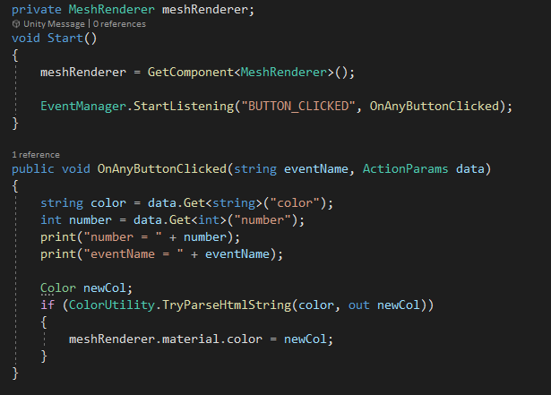

# EventManagers

## Intro

Unity doesn't offer a built-in EventManger, however it does offer a **UnityEvent** - A generic argument persistent callback that can be saved with the Scene.
You can read more about it here:
https://docs.unity3d.com/ScriptReference/Events.UnityEvent_2.html

If you want to see why you should use one then check this out:
https://bf.wtf/event-driven-unity-one/

There isn't one perfect EventManger, it dependes on the type of events your game uses.
Here I go through the different EventMangers added in this project.

The main difference is the type of data that is passed in the event, if at all.

## EventManager - No parameters
Here's a link to an EventManager that passes no parameters with its events. This is perfect if you just want to inform other components that an action happened.    
https://learn.unity.com/tutorial/create-a-simple-messaging-system-with-events#5cf5960fedbc2a281acd21fa

## EventManager_1 - stringified json parameters
Use: Rename file to "EventManager" and add to a GameObject in the scene.

This EventManager is capable of passing a string with its events. 
You can pass anything as a string as long as both sides (dispatcher and listener) know the structure of the parameters.
A very practical use for this is by serializing a scriptable object to a json string and passing it that way, on the other end we'll deserialize it back to a scriptable object.
This also ensures a contract: both sides know the format of the data and there aren't any surprises.

The code of the EventManager_1 is under the "Scripts" folder. 

Example:

The scriptable object of the data passed in the event:

The Blade dispatches an event with the BladeHitData for any collision with another object:

The Bomb listens to the event of a hit by the blade. If it hits him then he reacts.

The main disadvantage of this solution is that every different type of event data requires a scriptable object.

## EventManager_2 - Dictionary <T> parameters
Use: Rename file to "EventManager" and add to a GameObject in the scene.  
Credit to https://github.com/StavFaran92

This EventManager is capable of passing a Dictionary with its events, where every key-value is <string, object>. 
This allows us to pass any parameters for any event and not have to maintain any limiting pre-defined structure.
In this case, the listeners need to know the format and types of the parameters.

The code of the EventManager_2 is under the "Scripts" folder. 

Example:

The button dispatches a color and a number every time it's pressed:

The Cube listens to every click of the button and changes its color to the color passed from the button.

In my example I've got 2 buttons, 1 passing color "FF0000" (Red) and the other "0000FF" (Blue).

* It's good practice not to have the actual event name string throughout the code. Instead maintain const files with a static const variable of the event name. This way you're less prone to spelling mistakes. Plus, a change in the event name only requires changing it in the const file.